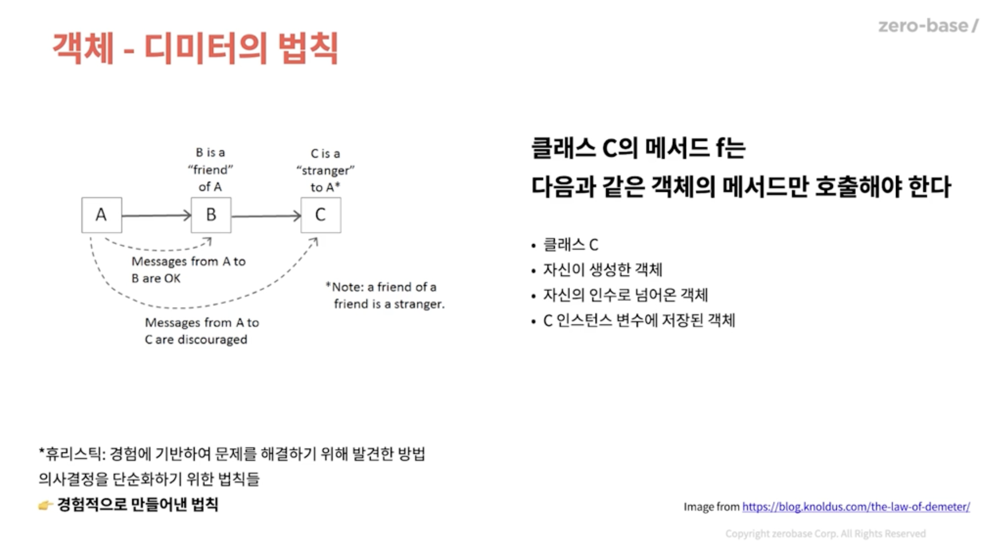

# CHAPTER 06 객체와 자료구조로 데이터 표현하기

```java
public Car(double fuelTankCapacitInGallons, double gallonsOfGasoline) {
		if (fuelTankCapacitInGallons <= 0) {
				throws new IllegalArgumentException("fuelTankCapicitInGallons must be greater than zero");
		}
		this.fuelTankCapacitInGallons = fuelTankCapacitInGallons;
		this.gallonsOfGasoline = gallonsOfGasoline;
}
```

### 자료구조 VS 객체



