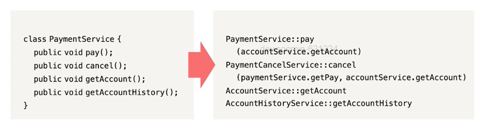
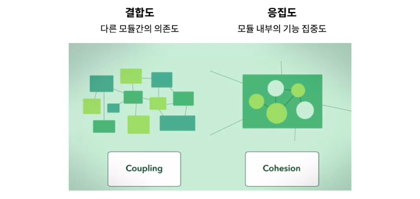
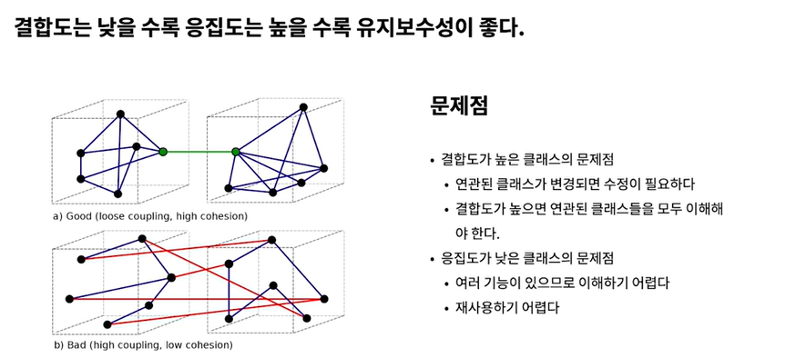
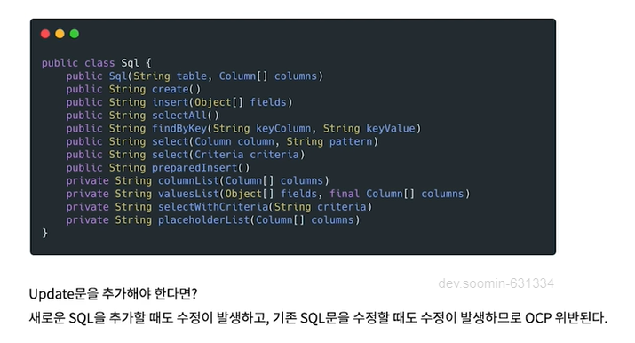
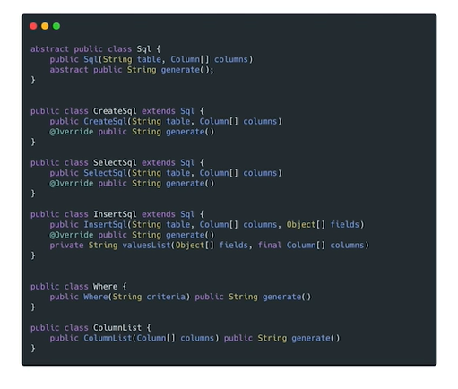

# 클래스 잘 설계하기

## 캡슐화되어야 한다

- 객체의 실제 구현을 외부로부터 감추는 방식
- 클래스를 개발할 때 기본적으로 구현을 감추고, 외부 객체와 상호작용하는 부분만 노출한다
- 외부의 잘못된 사용을 방지한다
- 경계에서 배웠던 Map 과 동일한 개념

```java
public class Stack {
		private int topOfStack = 0;
		private List<Integer> element = new LinkedList<Integer>();

		public List<Integer> getElements() {
				return elements;
		}

		public int size() {
				return topOfStack;
		}

		public void push() throws PoppedWhenEmpty {
				if (topOfStack == 0) {
						throw new PoppedWhenEmpty();
				}
				int element = elements.get(--topOfStack);
				elements.remove(topOfStack);
				return element;
		}
}
```

→ Stack 예제

- 필드를 private 로 제한, get 으로 읽기
- 수정은 push, pop 메서드를 통해서 일어나도록 제한

## 단일 책임 원칙

### 클래스는 작아야 한다

→ 클래스가 맡은 책임이 한개인가?

- 함수와 마찬가지로 클래스도 작아야한다.
- 함수는 라인 수로 크기를 측정했는데, 클래스는 맡은 책임의 수로 크기를 측정한다.
- 클래스 설명은 만일, 그리고, 하며, 하지만을 사용하지 않고 25단어 내외로 가능해야 한다. → 즉, 책임이 한가지여야 한다.

> 자잘한 단일 클래스가 많아지면 큰 그림을 이해하기 어렵다고 우려한다. 하지만 작은 클래스가 많은 시스템이든 큰 클래스가 몇개뿐인 시스템이든 돌아가는 부붐은 그 수가 비슷하다
>

> 큼직한 다목적 클래스 몇개로 이루어진 시스템은 변경을 가할 때 당장 알 필요가 없는 사실까지 들이밀어 독자를 방해한다.
>



## 낮은 결합도, 높은 응집도






- 낮은 결합도
    - 시스템의 결합도를 낮추면 유연성과 재사용성도 더욱 높아진다.
    - DIP - 클래스가 상세한 구현이 아니라 추상화에 의존해야 한다.
    - 추상화를 이용하면 테스트 코드 짜기에 용이하다

- 높은 응집도
    - 클래스는 인스턴스 변수 수가 적어야 한다. 메서드는 인스턴스 변수를 하나 이상 사용해야 한다. 메서드가 인스턴스 변수를 많이 사용할수록 응집도가 높다.
    - 응집도가 높다 = 클래스에 속한 메서드와 변수가 서로 의존하며 논리적인 단위로 묶인다 = 서로 관계 있는 애들만 모여 있다.
    - 클래스가 응집도를 잃어간다면 함수를 쪼개야 한다.

## 변경하기 쉬워야 한다

bad case)



good case)



- 공개 인터페이스를 전부 SQL 클래스에서 파생하는 클래스로 만들고, 비공개 메서드는 해당 클래스로 옮기고, 공통된 인터페이스는 따로 클래스로 뺸다.
- 기존의 클래스를 건드리지 않아도 된다.