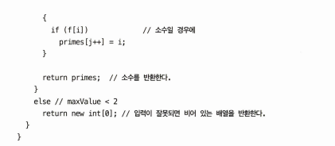
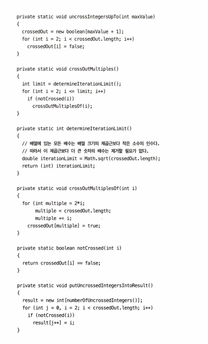

## 요약
애초에 주석이 필요없도록 코드를 정리하라.

## 주석은 나쁜 코드를 보완하지 못한다

## 코드로 의도를 표현하라!

## 좋은 주석
### 법적인 주석
회사가 적립한 구현 표준에 맞춰 명시한 주석  
ex. 저작권 정보, 소유권 정보, 표준 라이선스, 외부 문서

### 정보를 제공하는 주석
그러나 가능한 함수 이름에 정보를 포함하라.

### 의도를 설명하는 주석
구현을 이해하는 선을 넘어 결정에 깔린 의도까지 설명하는 주석

### 의미를 명료하게 밝히는 주석
모호한 인수나 반환값을 읽기 좋게 표현한 주석  
일반적으로는 본인이 명확하게 구현해야하나, 표준 라이브러리나 변경이 불가능한 코드에 사용하라.

### 결과를 경고하는 주석
ex. 특정 테스트 케이스를 꺼야하는 주석(여유 시간이 충분하지 않다면 실행하지 마십시오)  
-> 요즘에는 @Ignore("실행이 너무 오래 걸림") 가능
ex. 변경하지 말아야할 구현에 대해 이유를 설명한 주석

### TODO 주석
시스템에 나쁜 코드를 남겨 놓는 핑계가 되어선 안된다.  
TODO 너무 많은 코드도 바람직하지 않다. 주기적으로 점검하여 없애라.

### 중요성을 강조하는 주석
대수롭게 여겨질 무언가의 중요성을 강조

### 공개 API에서 Javadocs
공개 API를 구현한다면 반드시 훌륭한 Javadocs를 작성하라.  
단, Javadocs도 잘못된 정보를 전달할 수 있음을 주의하라.

## 나쁜 주석
좋은 주석 외 모든 주석

### 의무감에 주설거리는 주석

### 같은 이야기를 중복하는 주석
코드 내용을 중복한 주석

### 오해할 여지가 있는 주석
코드의 정보를 제대로 전달하지 않는 주석

### 의무적으로 다는 주석

### 이력을 기록하는 주석
현재는 코드 관리 시스템이 있으므로 필요없다

### 있으나 마나 한 주석
당연한 사실을 전달하는 주석  
반복될 경우 개발자가 주석을 무시하는 습관이 생긴다

### 무서운 잡음
문서를 제공하기 위해 아무 의미 없는 주석을 다는 것

### 함수나 변수로 표현할 수 있다면 주석을 달지 마라
주석이 필요하지 않도록 코드를 개선하라

### 위치를 표시하는 주석
배너와 같은 주석은 특정 기능을 모아놓기에는 유용한 경우도 있으나 가독성을 낮춘다.

### 닫는 괄호에 다는 주석
중첩이 심하고 장환한 함수에만 필요하다. 닫는 괄호에 주석이 필요하다 느껴진다면 대신 함수를 줄여보자.

### 공로를 돌리거나 저자를 표시하는 주석
요즘엔 소스코드 관리 시스템이 있으니 굳이 달지 말자.

### 주석으로 처리한 코드

### HTML 주석

### 전역 정보
시스템의 전반적인 정보를 기술하지 말라. 기본 포트 정보 등은 변할 수 있다.

### 너무 많은 정보 

### 모호한 관계
주석과 코드의 관계가 명확하지 않은 것

### 함수 헤더
짧고 한가지만 수행하며 이름을 잘 붙인 함수가 주석으로 헤더를 추가한 함수보다 훨씬 좋다.

### 비공개 코드에서 javadocs

### 예제
before refactoring

after refactoring

