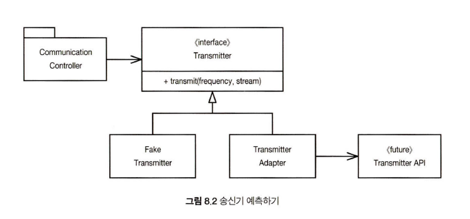

## 요약
외부코드와 자신의 코드의 경계를 분명히 구분할 필욕 있다.  
인터페이스를 사용하여 구분하라.  

## 외부 코드 사용하기
```java
Map<String, Sensor> sensors = new HashMp<Sensor>();
...
Sensor s = seneors.get(senserId);
```
외부 인터페이스는 버전이 업그레이드 될 때 수정이 될 수 있다.  
기존의 코드와 경계 없이 막 섞어서 쓰게 될 경우 이후 변경되었을 때 수정하기가 불편하다.  
다음은 외부 코드를 캡슐화하여 경계를 구분지은 코드이다.  
```java
public class Sensor {
	private Map sensors = new HashMap();
	
	public Sensor getById(String id){
		return (Sensor) seneors.get(id);
	}
}
```

## 학습 테스트는 공짜 이상이다
학습 테스트를 만들자! @Test
패키지의 새 버전이 나온다면 학습 테스트를 돌려 차이가 있는지 확인할 수 있다.  
테스트 결과의 기대치를 정의하라.    

## 아직 존재하지 않는 코드를 사용하기
아직 API가 나오지 않은 미지의 코드를 만난다면,  
1. 인터페이스를 만들어 자신의 코드와 외부 코드의 경계를 구분짓고(이는 의미를 명확하게 하는데도 좋다),  
2. Fake class를 만들어 코드를 작성한 다음, 
3. 이후 API가 나온 후에는 Adapter를 만들어 구현의 간극을 메운다.
  
 