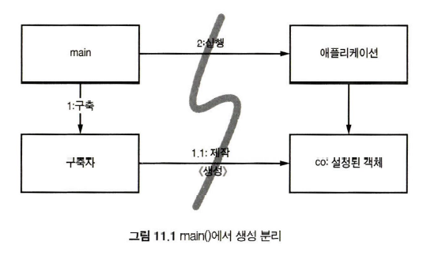
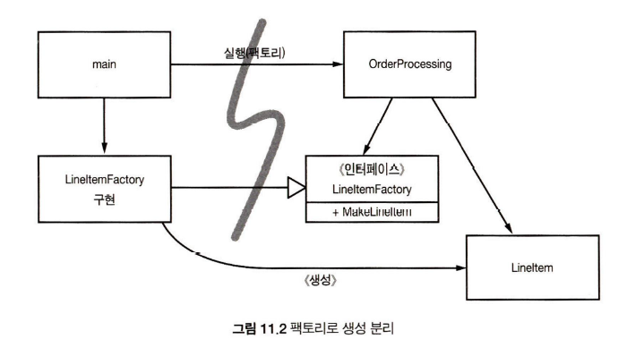

# 시스템 제작과 시스템 사용을 분리하라
초기화 지연(계산 지연) : 생성이 필요한 시점에 객체를 생성한다.  
- 장점 : 불필요한 부하가 없어 어플리케이션 시작 속도가 빠르다, 어떤 경우에도 null을 반환하지 않는다.
- 단점 : 생성되는 객체가 생성하는 메소드에 의존한다. 해당 시점에 생성되야할 객체가 다른 것일 우려가 있다. 모듈성이 저조하고 중복이 심하다.

## Main 분리
생성과 관련된 코드는 모두 main이나 main이 호출하는 모듈로 옮기는 방법  
나머지 시스템은 모든 객체가 생성되었고 의존성이 연결되었다고 가정한다.
즉 어플리케이션은 main이나 객체가 생성되는 과정을 전혀 모른다.

  


## 추상 팩토리 패턴 ( Abstract Factory Pattern )
구체적인 클래스에 의존하지 않고 서로 연관되거나 의존적인 객체들의 조합을 만드는 인터페이스를 제공하는 패턴  
ex) TVFactory <- SamsungTV, LGTV  
어플리케이션은 객체가 생성되는 시점을 결정하지만, 객체가 생성되는 구체적인 방법은 모른다.  

  

참고 : https://readystory.tistory.com/119?category=822867

- 추상 팩토리 패턴은 구현(Implements)보다 인터페이스(Interface)를 위한 코드 접근법을 제공합니다. 
	위 예에서 getComputer() 메소드는 파라미터로 인터페이스를 받아 처리를 하기 때문에 getComputer() 에서 구현할 것이 복잡하지 않습니다.
- 추상 팩토리 패턴은 추후에 sub class를 확장하는 데 있어 굉장히 쉽게할 수 있습니다. 
	위 예에서 만약 Laptop 클래스를 추가하고자 한다면 getComputer()의 수정 없이 LaptopFactory만 작성해주면 됩니다. 
	이러한 특징에 기반하여 추상 팩토리 패턴은 "Factory of Factories"라고도 불립니다.
- 추상 팩토리 패턴은 팩토리 패턴(팩토리 메소드 패턴)의 조건문(if-else, switch 등)으로부터 벗어납니다.


## 의존성 주입(Dependency Injection)
필요한 객체를 직접 생성하는 것이 아닌 외부로 부터 필요한 객체를 받아서 사용하는 방법  
대다수의 DI 컨테이너는 초기화 지연으로 얻을 수 있는 장점 가질 수 있도록 펙토리를 호출하거나 프로시를 생성하는 방법을 제공한다.  

참고 : https://velog.io/@wlsdud2194/what-is-di

- DI를 사용하지 않을 경우  
```java
class Coffee {...} // interface로 설계할 수도 있다

// Coffee 클래스를 상속
class Cappuccino extends Coffee {...}
class Americano extends Coffee {...}

// Programmer.java
class Programmer {
    private Coffee coffee;

    public Programmer() {
    	this.coffee = new Cappuccino(); // 직접 수정
        // 또는 
        this.coffee = new Americano(); // 직접 수정
    }
    
    ...
}
```
-  DI를 사용할 경우
```java
// Programmer.java
class Programmer {
    private Coffee coffee;

    // 그 날 마실 커피를 고를 수 있게된 개발자
    public Programmer(Coffee coffee) {
    	this.coffee = coffee;
    }
    
    public startProgramming() {
    	this.coffee.drink();
        ...
    }
}
``` 

# 확장
'처음부터 올바르게' 시스템을 만들 수 없다!  
그래도 관심사를 적절히 분리해 관리한다면 소프트웨어 아키텍처는 점진적으로 발전할 수 있다.  

## 횐단(cross-cutting) 관심사를
# 자바 프록시

# 순수 자바 AOP 프레임워크

# AspectJ 관점

# 테스트 주도 시스템 아키텍처 구축

# 의사 결정을 최적화 하라
가능한 마지막 순간까지 결정은 미루는 방법이 최선일 수 있다.

# 명백한 가치가 있을 때 표준을 현명하게 사용하라
과장된 표준에 집착하면 실제 해결하고자하는 문제가 보이지 않을 수 있다.

# 시스템은 도메인 특호 언어가 필요하다.


 
